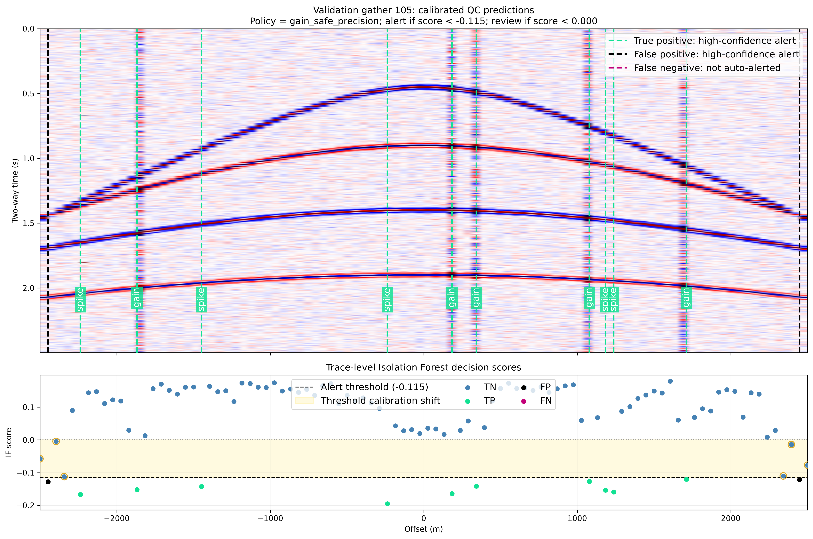

This project implements a controlled benchmark for seismic trace-level quality control on synthetic CMP-style gathers with hyperbolic moveout events. An Isolation Forest is trained exclusively on normal traces, with synthetic injected anomalies used only for calibration and held-out evaluation.

Key aspects:

- Realistic synthetic gathers with three anomaly classes: dead traces, gain anomalies, and spikes.
- Group-aware splitting by gather ID to prevent data leakage.
- Normal-only unsupervised training, with threshold calibration on separate gathers.
- Subtype-specific recall analysis showing that a strict global threshold improves aggregate F1 but reduces gain-anomaly recall.
- Interpretable prediction overlays with anomaly scores, calibrated thresholds, and an uncertainty band.

The design intentionally separates the synthetic benchmark from real-field data. A separate workflow is planned for real SEG-Y profile QC, as the zero-offset spatial profile representation differs from prestack offset gathers.

Links:

- [GitHub repository](https://github.com/frasera00/seismic-quality-intelligence)
